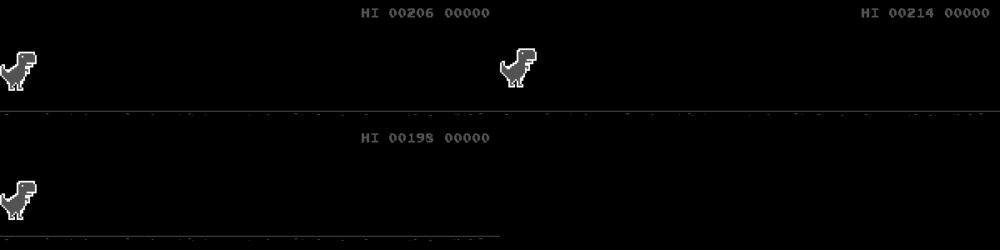

# Proyecto - Chrome Dino con DQN

- Carlos Molina
- Mayra Salazar
  
## Sobre el proyecto



  
Se trata de enseñarle al chrome dino como se debe jugar por si mismo.
Originalmente, debería de ser un algoritmo que utiliza DQN, sin embargo optamos por el PPO2 ya que en el módulo stable-lines el DQN no soporta multiprocesos.  

Utilizamos `pyenv` para poder hacer un downgrade de Python 3.8.10 a Python 3.7.1, ya que el módulo `stable-lines` utiliza una versión vieja de Tensorflow (1.15).  

Para correr el proyecto:  

```Bash
    pipenv install
```
```Bash
    pipenv shell
```
```Bash
    ./dinoAI.py true
```


## Bibliografía y referencias:
- https://arxiv.org/abs/1707.06347
- https://arxiv.org/abs/1502.05477
- https://arxiv.org/abs/1502.05477
- https://arxiv.org/abs/1509.06461
- https://stable-baselines.readthedocs.io/en/master/modules/policies.html
- https://towardsdatascience.com/a-comprehensive-guide-to-convolutional-neural-networks-the-eli5-way-3bd2b1164a53
- https://cs231n.github.io/convolutional-networks/https://ibm.com/cloud/learn/convolutional-neural-networks
- https://stable-baselines.readthedocs.io/en/master/modules/ppo2.html
- https://stable-baselines.readthedocs.io/en/master/guide/examples.html?highlight=gif#id2
- https://medium.com/deelvin-machine-learning/how-to-play-google-chrome-dino-game-using-reinforcement-learning-d5b99a5d7e04

